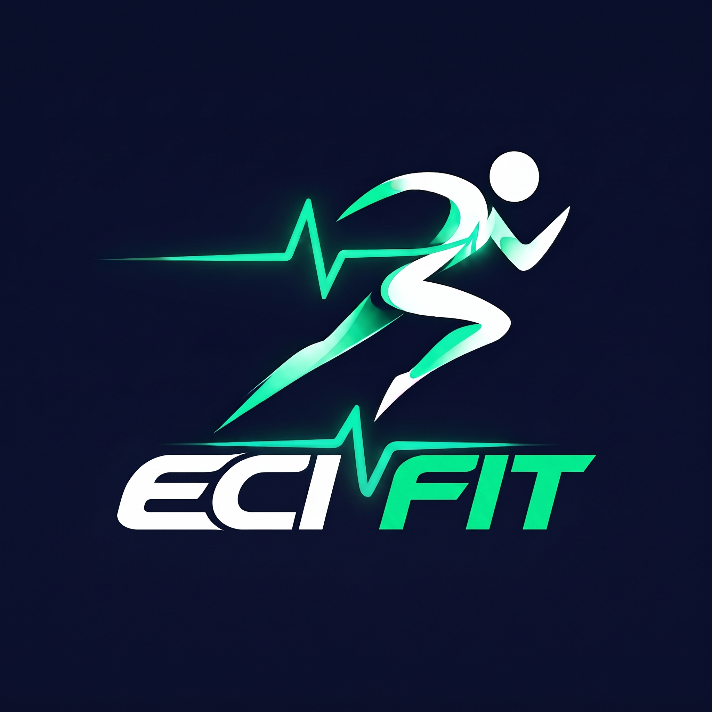
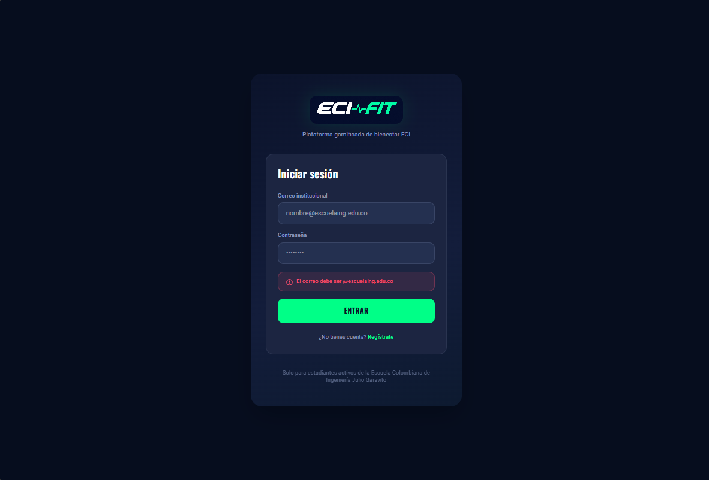
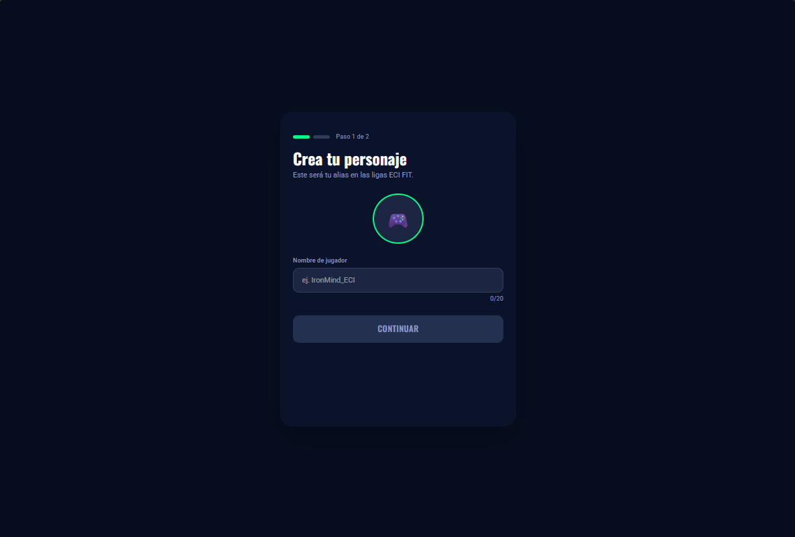
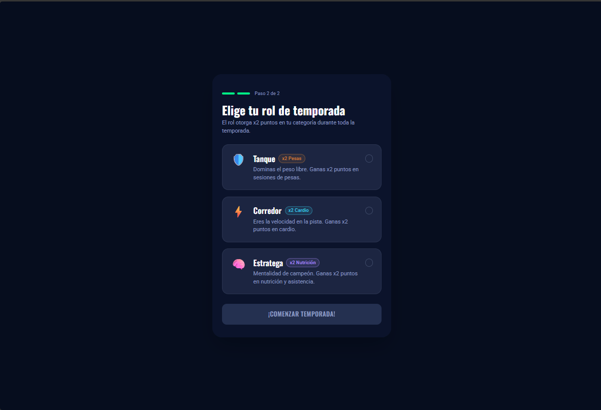
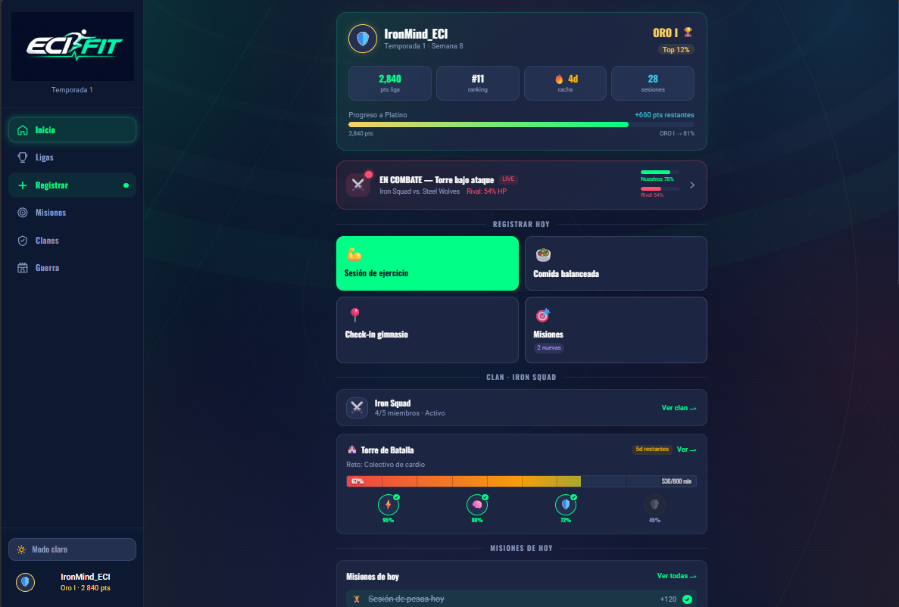
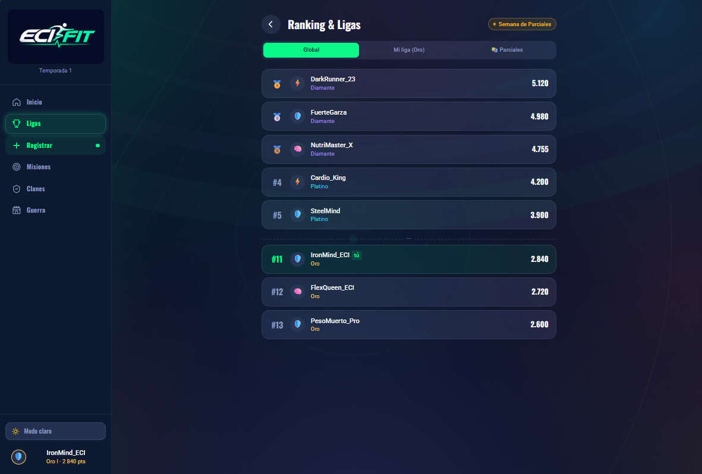
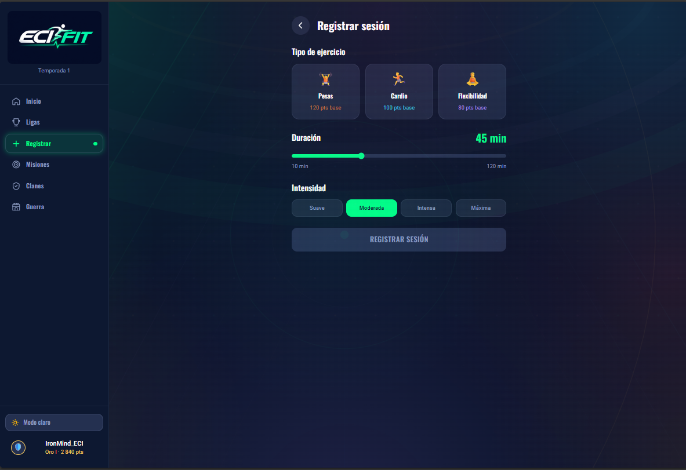
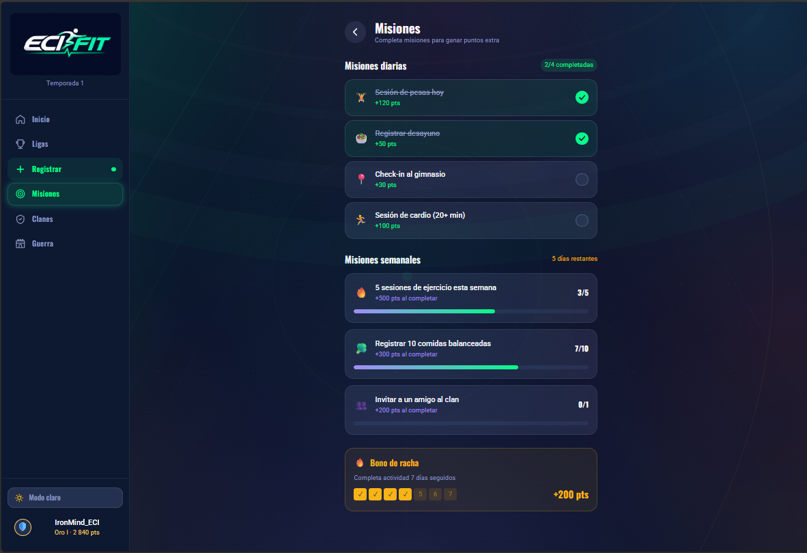
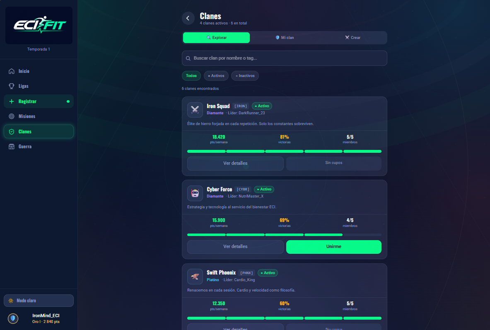
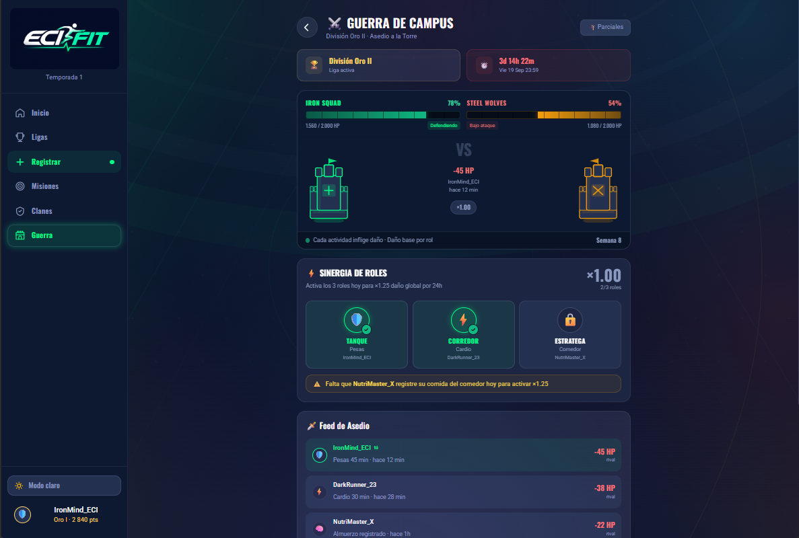

# 🏋️‍♂️ ECI FIT

> 🎮 **Plataforma web gamificada de bienestar físico para la comunidad de la Escuela Colombiana de Ingeniería Julio Garavito.**

ECI FIT busca integrar actividad física, nutrición, descanso y actividades deportivas dentro de una experiencia gamificada que motive a la comunidad ECI a desarrollar hábitos saludables.

---

## 👥 Integrantes

| 👤 Integrante |
|---|
| Daniel Villamizar |
| Daniel Barrera |
| Juan Munar |
| Julian Giral |
| Sebastian Granados |

---

## 🎯 Contexto del proyecto

ECI FIT nace como una propuesta para fomentar el bienestar físico dentro de la comunidad de la Escuela Colombiana de Ingeniería Julio Garavito.

La plataforma busca integrar diferentes espacios y actividades de la universidad, como el gimnasio, la cafetería, las canchas y las actividades deportivas, utilizando elementos de gamificación para incentivar la participación.

### 🚀 ¿Qué busca ECI FIT?

- 🏃‍♂️ Fomentar la actividad física.
- 🥗 Promover hábitos de alimentación saludable.
- 😴 Incentivar hábitos relacionados con el descanso.
- 🎯 Proponer misiones y retos semanales.
- 🏆 Implementar ligas y temporadas.
- 👥 Crear clanes y dinámicas colaborativas.
- ⚔️ Generar competencias entre jugadores.
- 🏫 Integrar diferentes espacios y actividades de la ECI.

---

## 🧑‍🤝‍🧑 Comunidad objetivo

ECI FIT está pensado para la **comunidad de la Escuela Colombiana de Ingeniería Julio Garavito**.

### 🎓 Estudiantes

Los estudiantes pueden participar como jugadores, registrar actividades, completar misiones, pertenecer a clanes y participar en las diferentes dinámicas de gamificación.

### 👨‍🏫 Profesores

Los profesores también pueden participar como jugadores, independientemente de su nivel de actividad física.

### 🏋️ Entrenadores

Los entrenadores tienen funciones relacionadas con el seguimiento de la actividad física, asignación de rutinas y validación de asistencia.

### 🥗 Responsable de Nutrición

Se encarga de mantener y validar la información nutricional utilizada por la plataforma.

### ⚙️ Administración

Gestiona aspectos generales de la plataforma, temporadas, contenidos y configuraciones.

---

# 🎨 Identidad visual

## 🪪 Logotipo

El logotipo de ECI FIT representa la relación entre:

- 🏃 Actividad física
- ❤️ Bienestar
- 💻 Tecnología
- 🏫 Comunidad ECI

<p align="center">
  
</p>

---

## 📖 Manual de identidad

El manual de identidad contiene los lineamientos visuales de ECI FIT, incluyendo el uso del logotipo, colores, tipografía y demás elementos gráficos de la identidad del proyecto.

📚 **[Ver manual de identidad](./docs/manual-identidad/manual-identidad.html)**

---

## 🖌️ Prototipo UX/UI

Los diseños y flujos de navegación de **ECI FIT** fueron desarrollados en Figma.

🔗 **[🎨 Ver prototipo en Figma](https://www.figma.com/make/JCIrclYnSBOnLVtWOlqS7r/Desarrollar-mocks?fullscreen=1&t=zulUMUhfw3IMDuNT-1&code-node-id=0-6)**

El prototipo permite visualizar las diferentes pantallas y flujos planteados para la plataforma antes de su implementación.
---

# 🧩 Módulos de la aplicación

ECI FIT cuenta con diferentes módulos que permiten al usuario participar
en una experiencia de bienestar físico basada en actividad, progreso,
competencia y colaboración.

---

## 🔐 Inicio de sesión

Pantalla de acceso a ECI FIT mediante el correo institucional de la
Escuela Colombiana de Ingeniería Julio Garavito.

El prototipo contempla validación del correo institucional y mensajes
de error cuando los datos ingresados no cumplen con el formato esperado.

<p align="center">
  
</p>

---

## 🎮 Creación del personaje

Después de iniciar sesión, el usuario puede crear su personaje para
participar en las dinámicas de las ligas de ECI FIT.

En esta pantalla puede:

- 👤 Definir su nombre de jugador.
- 🎮 Personalizar la identidad inicial de su personaje.
- 📈 Avanzar dentro del proceso de configuración.

<p align="center">
  
</p>

---

## 🛡️ Selección de rol

El usuario selecciona el rol que tendrá durante la temporada.

El prototipo presenta tres roles:

- 🛡️ **Tanque:** orientado a actividades de fuerza.
- ⚡ **Corredor:** orientado a actividades cardiovasculares.
- 🧠 **Estratega:** orientado a nutrición y asistencia.

Cada rol cuenta con una categoría específica y proporciona
multiplicadores de puntos en determinadas actividades.

<p align="center">
  
</p>

---

## 🏠 Inicio

El inicio funciona como el panel principal del jugador.

Desde esta pantalla se puede consultar:

- ⭐ Puntos y progreso en la liga.
- 🏆 Ranking actual.
- 🔥 Racha de actividad.
- 🏋️ Sesiones registradas.
- ⚔️ Estado de combate de la Guerra de Campus.
- 🎯 Misiones disponibles.
- 👥 Información del clan.
- 🏰 Progreso de la Torre de Batalla.

También permite acceder rápidamente a acciones como registrar una
sesión de ejercicio, registrar una comida balanceada, realizar un
check-in en el gimnasio y consultar las misiones.

<p align="center">
  
</p>

---

## 🏆 Ranking y ligas

Este módulo permite consultar la posición de los jugadores dentro
del sistema competitivo de ECI FIT.

El prototipo permite visualizar:

- 🌎 Ranking global.
- 🏅 Liga actual.
- 📊 Puntos de cada jugador.
- 🥇 Posición en el ranking.
- 🎓 Clasificación durante la semana de parciales.

El jugador puede identificar su posición y compararla con otros
participantes.

<p align="center">
  
</p>

---

## 🏋️ Registrar sesión

Este módulo permite registrar una sesión de actividad física.

El usuario puede seleccionar:

- 🏋️ **Pesas**
- 🏃 **Cardio**
- 🧘 **Flexibilidad**

También puede definir:

- ⏱️ Duración de la sesión.
- 💪 Intensidad del ejercicio.
- ⭐ Puntos base obtenidos.

<p align="center">
  
</p>

---

## 🎯 Misiones

El módulo de misiones presenta diferentes actividades que el jugador
puede completar para obtener puntos y avanzar dentro de la temporada.

Se presentan:

### 📅 Misiones diarias

Permiten completar actividades como:

- 🏋️ Sesiones de pesas.
- 🥗 Registro de alimentación.
- 📍 Check-in en el gimnasio.
- 🏃 Sesiones de cardio.

### 📆 Misiones semanales

Incluyen objetivos acumulativos relacionados con:

- 🏋️ Sesiones de ejercicio.
- 🥗 Comidas balanceadas.
- 👥 Invitaciones a un clan.

También se muestra el progreso de cada misión y las recompensas
obtenidas al completarla.

<p align="center">
  
</p>

---

## 👥 Clanes

El módulo de clanes permite explorar y participar en grupos de
jugadores dentro de ECI FIT.

El prototipo permite:

- 🔎 Explorar clanes.
- 🔍 Buscar clanes por nombre o etiqueta.
- 🟢 Filtrar clanes activos e inactivos.
- 👥 Consultar cantidad de miembros.
- 🏆 Consultar liga y estadísticas del clan.
- 📊 Consultar puntos semanales y porcentaje de victorias.
- 🤝 Unirse a un clan cuando existen cupos disponibles.
- ⚔️ Consultar información de los clanes.

<p align="center">
  
</p>

---

## ⚔️ Guerra de Campus

La Guerra de Campus es una de las principales dinámicas competitivas
del prototipo.

En este módulo los clanes se enfrentan mediante una dinámica de
ataque y defensa de una torre.

La pantalla permite visualizar:

- 🏰 Torre de cada equipo.
- ❤️ Puntos de vida de las torres.
- ⚔️ Daño realizado por los jugadores.
- 🛡️ Estado de defensa o ataque.
- ⏱️ Tiempo restante del enfrentamiento.
- 🧩 Sinergia entre los diferentes roles.
- 📊 Feed de asedio con las actividades realizadas.
- 🎓 Eventos especiales como la semana de parciales.

Los roles seleccionados por los jugadores participan en la estrategia
del enfrentamiento y pueden generar bonificaciones cuando se
completan las condiciones correspondientes.

<p align="center">
  
</p>
---

# 🛠️ Tecnologías

### 💻 Frontend

- ⚛️ React
- 📘 TypeScript
- ⚡ Vite

### 🎨 Diseño

- 🎨 Figma
- 🖌️ Manual de identidad visual

---

# 📂 Estructura del proyecto

```text
ecifit-frontend/
│
├── 📁 docs/
│   ├── 📁 manual-identidad/
│   │   └── 📄 manual-identidad.html
│   │
│   ├── 📁 mockups/
│   │   ├── 🖼️ login.png
│   │   ├── 🖼️ crear-personaje.png
│   │   ├── 🖼️ seleccion-rol.png
│   │   ├── 🖼️ inicio.png
│   │   ├── 🖼️ ranking-ligas.png
│   │   ├── 🖼️ registrar-sesion.png
│   │   ├── 🖼️ misiones.png
│   │   ├── 🖼️ clanes.png
│   │   └── 🖼️ guerra-campus.png
│   │
│   └── 📁 logo/
│       └── 🖼️ ecifit-logo.jpg
│
├── 📁 public/
│
├── 📁 src/
│   ├── 📄 App.tsx
│   ├── 📄 App.css
│   ├── 📄 main.tsx
│   └── 📄 index.css
│
├── 📄 .gitignore
├── 📄 index.html
├── 📄 package.json
├── 📄 package-lock.json
├── 📄 vite.config.ts
└── 📄 README.md